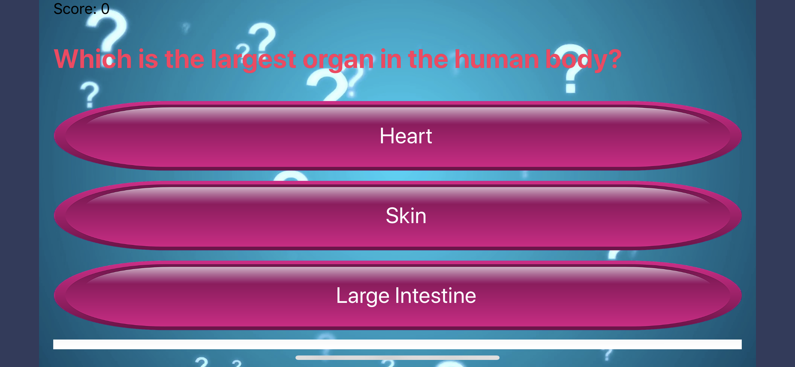

# Quiz2.0
A multiple choice question educational quiz application that calculates your score. This app is optimized to take any number of questions with three choices and one correct answer. This app was created following Angela Yu's course on Udemy with some modifications.

 
                   
